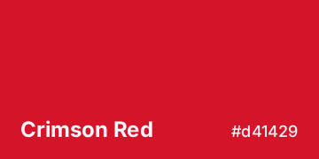
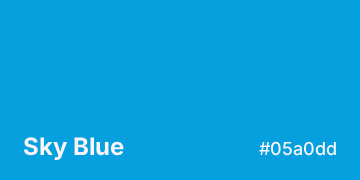
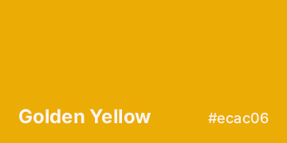
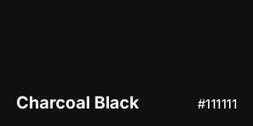
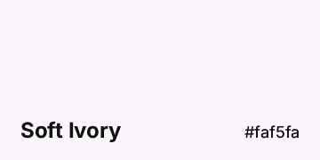

# MTUMods Brandkit

<https://mtumods.com>

This repository contains the Branding Assets of the MTUMods project.

<!-- - First read the [Brand Guide](#) -->
- Different assets such as logo variants

## MTUMods Logo

### Primary Logo

[SVG](logos/svg/mtumods.svg)
[PNG](logos/png/mtumods-256-transparent.png)
[JPG](logos/jpg/mtumods-256.jpg)

## Colours

| Name              | Hex           |
| ----------------- | ------------- |
| Crimson Red       | `#d41429`     |

| Name              | Hex           |
| ----------------- | ------------- |
| Sky Blue          | `#05a0dd`     |

| Name              | Hex           |
| ----------------- | ------------- |
| Golden Yellow     | `#ecac06`     |

| Name              | Hex           |
| ----------------- | ------------- |
| Charcoal Black    | `#111111`     |

| Name              | Hex           |
| ----------------- | ------------- |
| Soft Ivory        | `#faf5fa`     |

## Usage

- Prefer SVG for digital use (web, screen).
- Use PNG where SVG is not supported.
- Use PDF for print materials.
- Do not alter colors, proportions, or other visual properties of the logos.
